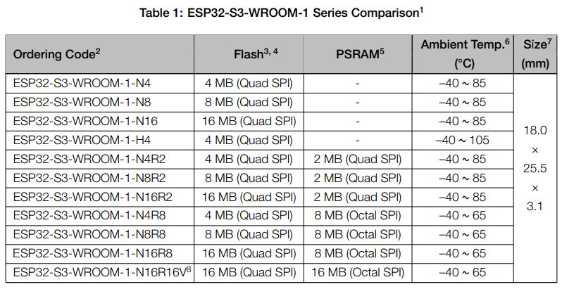
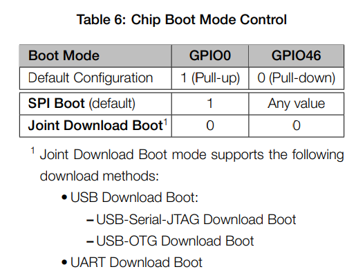
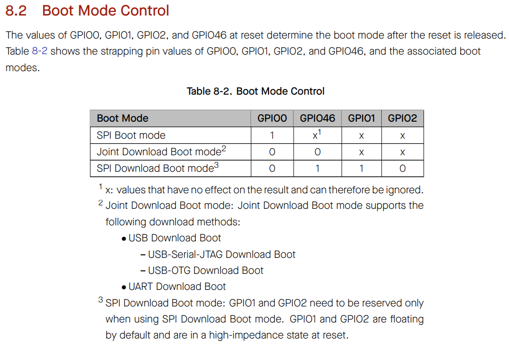

ESP32-S3-WROOM-1

  GPIO

    EN (1)
      High: on, enables the chip.
      Low: off, the chip powers off.
      Do not leave the EN pin floating

    3V3, GND, GND (3)

    19, 20  (2)
      USB OTG
        D-: 19
        D+: 20
      ADC2
        CH8: 19
        CH9: 20

    35, 36, 37 (3)
      In Octal SPI PSRAM
      (ex: ESP32-S3R8, ESP32-S3R16V),
      not available for GPIO

    0 (1)
      strapping pins
        Chip Boot

    3 (1)
      strapping pins
        JTAG signal source

    45 (1)
      strapping pins
        VDD_SPI voltage

    46 (1)
      strapping pins
        Chip Boot
        ROM message printing

    39, 40, 41, 42 (4)
      JTAG

    43, 44 (2)
      UART
        TX: 43
        RX: 44

    1, 2, 3, 4, 5, 6, 8, 9, 10          ADC1 (ADC1_CH0 ~ ADC1CH9)
    11, 12, 13, 14, 15, 16, 17, 18      ADC2 (ADC2_CHO ~ ADC2CH7)
    21, 38, 47, 48 (22)

    * Pin numbers: 40

   

  <h3>Octal PSRAM module</h3>

  R8, R16 -> N4R8, N8R8, N16R8, N16R8, N16R16V

  

   

  <h3>Chip Boot Mode Control</h3>

  
  